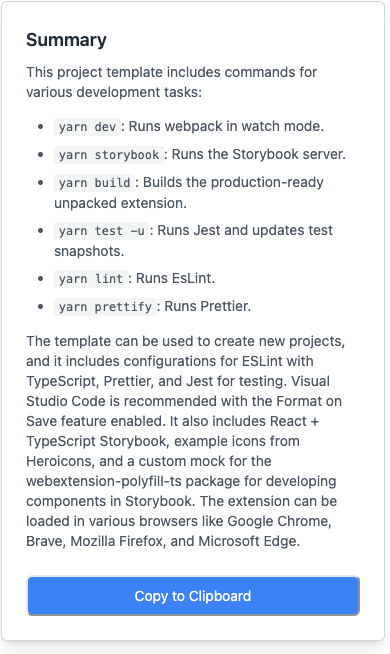

# AI-Powered Text Summarizer Chrome Extension

## Overview

This Chrome extension provides an AI-powered text summarization tool that allows users to quickly generate concise summaries of selected text on any webpage. Leveraging OpenAI's advanced language models, this extension offers a seamless way to distill key information from lengthy articles, documents, or any text content.

## Features

- **Easy-to-use**: Simply select text on any webpage and right-click to summarize.
- **AI-powered**: Utilizes OpenAI's state-of-the-art language models for high-quality summaries.
- **Markdown Support**: Summaries are rendered in Markdown for improved readability.
- **Copy to Clipboard**: One-click copying of the generated summary.
- **Error Handling**: Graceful handling of API errors and invalid inputs.
- **Customizable**: Users can set their own OpenAI API key for personalized usage.

## How It Works

1. Select text on any webpage.
2. Right-click and choose "Summarize" from the context menu.
3. The extension will send the selected text to OpenAI's API.
4. A modal will appear with the AI-generated summary.

## Installation

1. Clone this repository or download the source code.
2. Open Chrome and navigate to `chrome://extensions`.
3. Enable "Developer mode" in the top right corner.
4. Click "Load unpacked" and select the directory containing the extension files.
5. The extension should now be installed and visible in your Chrome toolbar.

## Configuration

Before using the extension, you need to set up your OpenAI API key:

1. Click on the extension icon in the Chrome toolbar.
2. Enter your OpenAI API key in the provided field.
3. Click "Save" to store your API key securely.

## Development

This project uses the following technologies:

- TypeScript for type-safe JavaScript
- React for the user interface
- Tailwind CSS for styling
- Webpack for bundling

To set up the development environment:

1. Run `yarn install` to install dependencies.
2. Use `npm run dev` to build the extension.
3. For development, use `npm run dev` to watch for file changes and rebuild automatically.

## Contributing

Contributions are welcome! Please feel free to submit a Pull Request.

## License

This project is licensed under the MIT License.
